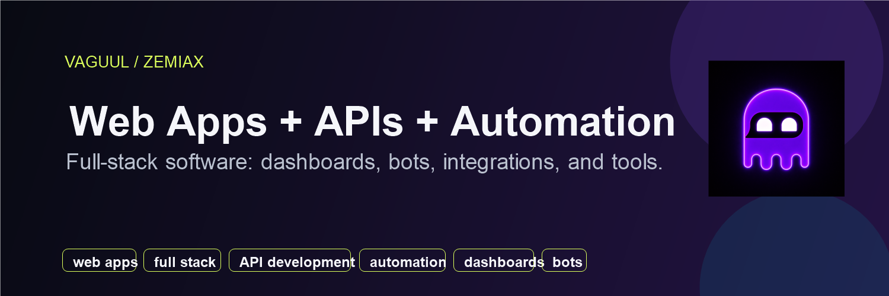

# Vaguul

I build practical software across the full stack: websites, web apps, dashboards, APIs, automations, bots, scripts, integrations, developer tools, and deployment-ready workflows.

Most of my public work sits under the Vaguul/Zemiax name. Some projects are public utilities, and some product work stays private until there is a clean piece worth releasing.

## What I Build

- websites, landing pages, portfolios, and business pages
- full-stack web apps, dashboards, admin panels, and MVPs
- APIs, backend services, integrations, and data workflows
- automation scripts, notifications, cleanup tools, and internal operations
- Discord/Telegram bots, control panels, command systems, and bot tooling
- frontend, backend, CI/CD, Docker, GitHub Actions, and deployment workflows
- debugging, feature patches, tests, docs, and code cleanup

## Public Projects

- [discord-command-controls](https://github.com/vaguul/discord-command-controls) - command policy helpers for Discord bots and dashboards.
- [coolify-stack-starters](https://github.com/vaguul/coolify-stack-starters) - starter stacks for web apps, APIs, workers, and databases.
- [compose-config-env-lint](https://github.com/vaguul/compose-config-env-lint) - CLI checks for Docker Compose config/env mistakes.
- [oss-maintainer-snapshot](https://github.com/vaguul/oss-maintainer-snapshot) - read-only GitHub queue reports for issues and pull requests.
- [social-feed-inputs](https://github.com/vaguul/social-feed-inputs) - parser utilities for social/feed inputs and automation.
- [dark-founder-portfolio](https://github.com/vaguul/dark-founder-portfolio) - portfolio site work.

## Current Focus

- keeping public packages small, tested, and documented
- building reusable pieces for web apps, APIs, automation, bots, and dashboards
- maintaining CI, CodeQL, secret scanning, releases, and Dependabot updates
- extracting reusable pieces from private Zemiax product work when they can stand alone
- reviewing focused issues and pull requests around web apps, automation, Docker, GitHub, APIs, and developer tooling

## Public Roadmap

- [compose-config-env-lint issues](https://github.com/vaguul/compose-config-env-lint/issues) - CI output, Compose examples, and parser coverage.
- [discord-command-controls issues](https://github.com/vaguul/discord-command-controls/issues) - dashboard policy examples and role override fixtures.
- [coolify-stack-starters issues](https://github.com/vaguul/coolify-stack-starters/issues) - starter validation notes and deployment hardening.
- [social-feed-inputs issues](https://github.com/vaguul/social-feed-inputs/issues) - feed resolver fixtures and clearer unsupported-input behavior.
- [oss-maintainer-snapshot issues](https://github.com/vaguul/oss-maintainer-snapshot/issues) - queue summaries, output formats, and maintainer workflow examples.

## What I Work On

- landing pages, portfolios, and small business websites
- web apps, dashboards, admin panels, and MVP screens
- API development, backend services, and third-party integrations
- automation scripts, data workflows, and internal tools
- Discord/Telegram bot control panels and command systems
- Docker, Coolify, CI, and deployment workflows
- licensing, private admin systems, and operations software

## Available For

- landing pages, portfolios, and small business websites
- full-stack web apps, dashboards, admin panels, MVP screens, and internal tools
- API integrations, backend development, automation scripts, data cleanup, and notifications
- Discord/Telegram bots, command systems, and control panels
- frontend/backend fixes, feature patches, tests, and documentation
- Docker Compose, Coolify, CI, GitHub, and deployment setup
- fixed-scope programming work through [Contra](https://contra.com/s/lrs7rUkr-automation-api-integrations-and-internal-tools)

## Recent OSS Work

- [discord-command-controls v0.1.4](https://github.com/vaguul/discord-command-controls/releases/tag/v0.1.4) - added role override fixtures and dashboard policy examples with passing CI.
- [oss-maintainer-snapshot v0.1.2](https://github.com/vaguul/oss-maintainer-snapshot/releases/tag/v0.1.2) - added attention grouping for review-required PRs, blocked queues, and triage labels.
- [social-feed-inputs v0.1.2](https://github.com/vaguul/social-feed-inputs/releases/tag/v0.1.2) - added feed URL edge-case fixtures and clearer unsupported-domain behavior.
- [coolify-stack-starters v0.1.1](https://github.com/vaguul/coolify-stack-starters/releases/tag/v0.1.1) - added a starter validation matrix and closed the roadmap issue with passing checks.
- [dark-founder-portfolio v0.1.1](https://github.com/vaguul/dark-founder-portfolio/releases/tag/v0.1.1) - marked the starter as a GitHub template and documented template usage.
- [compose-config-env-lint v0.1.1](https://github.com/vaguul/compose-config-env-lint/releases/tag/v0.1.1) - added JSON output for CI and documented Compose interpolation examples.
- [AntiMicroX/antimicrox#1330](https://github.com/AntiMicroX/antimicrox/pull/1330) - fixed changelog external link behavior and added regression coverage.
- [gabrielgz0/pypncp#7](https://github.com/gabrielgz0/pypncp/pull/7) - added tests around resource `get()` methods.

## Links

- Portfolio: [vaguul.github.io/portfolio](https://vaguul.github.io/portfolio/)
- Service: [Web apps, automation, APIs, and internal tools on Contra](https://contra.com/s/lrs7rUkr-automation-api-integrations-and-internal-tools)
- Main public repo: [discord-command-controls](https://github.com/vaguul/discord-command-controls)
- Contact: [heyvaguul@gmail.com](mailto:heyvaguul@gmail.com)

## Notes

I keep public repos small, documented, and testable. If a software problem is specific and reproducible, I am usually open to looking at it.
